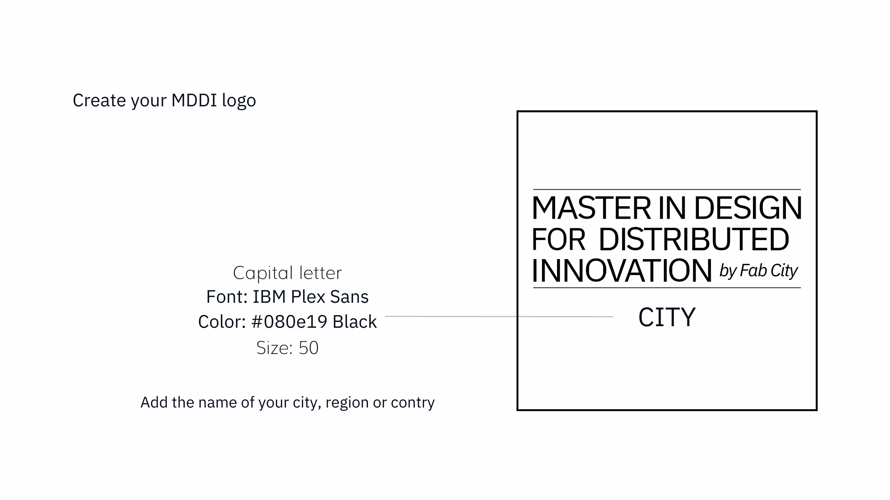
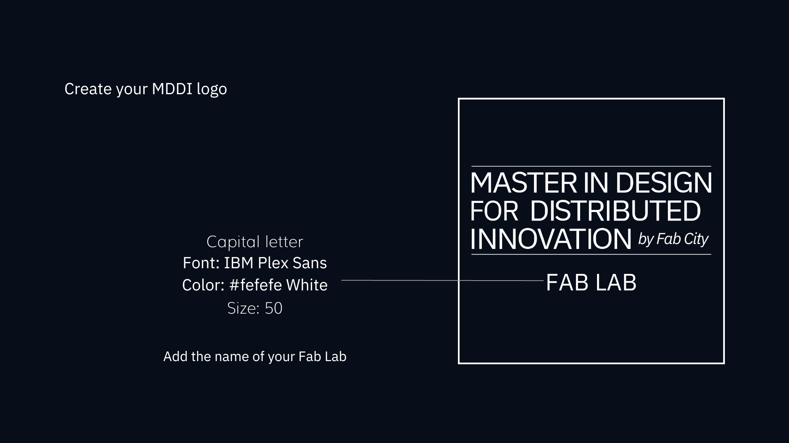

# MDDI Branding

As a node, you can create an affiliate logo to promote the program locally. Please follow the instructions below to create your identity:

<figure><figcaption></figcaption></figure>

<figure><figcaption></figcaption></figure>

☝️Download the full page and create your logo today [here](https://drive.google.com/drive/folders/1VP5IDWXXsOWfwgsr\_nTZtG4hkHtKhhMF)

Check some examples of how the Fab City Foundation used the MDDI Brand identity to promote the master's program:

.png>)

.png>)

.png>)

.png>)

